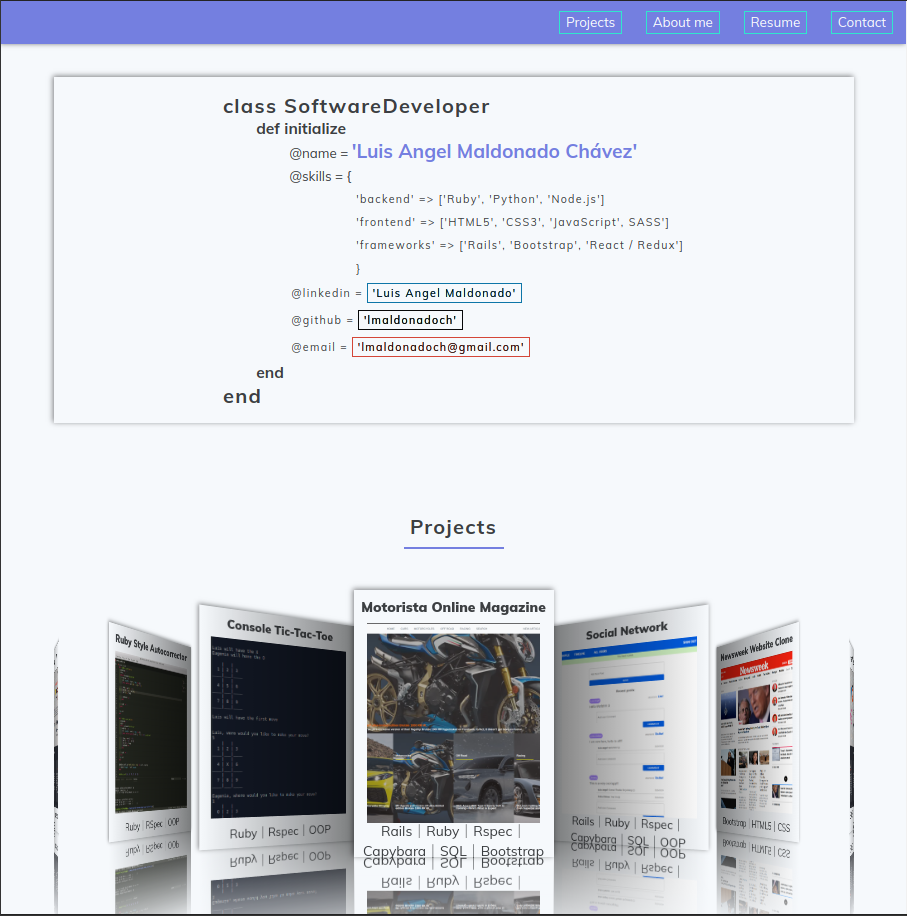

# Portfolio

> Here is my portfolio; it is a showcase for my most significant accomplishments. Here I show the most complex projects I have worked with and links to relevant sites like live versions and GitHub repos.




I used state-of-the-art front end design tools such as CSS animations and transitions, HTML5 elements, and SASS pre-processor. It is continuously updated as I move forward on my software development journey, so keep an eye on it!.

## Live version

[Live Version]()

## Built With

- HTML
- CSS
- Google fonts
- Font Awesome
- Sass

## Getting Started

To get a local copy of the repository please run the following commands on your terminal:

```
$ cd <folder>
```

```
$ git clone git@github.com:lmaldonadoch/portfolio.git
```

## Author

👤 **Luis Angel Maldonado**

- Github: [@lmaldonadoch](https://github.com/lmaldonadoch)
- Twitter: [@LuisAngelMCh](https://twitter.com/LuisAngelMCh)
- Linkedin: [linkedin](https://www.linkedin.com/in/luis-angel-maldonado-5b503a1a3/)

## 🤝 Contributing

Contributions, issues and feature requests are welcome!

Feel free to check the [issues page](https://github.com/lmaldonadoch/HTML-CSS-Capstone/issues).

## Show your support

Give a ⭐️ if you like this project!

## Acknowledgments

- Project inspired by Microverse Program.
